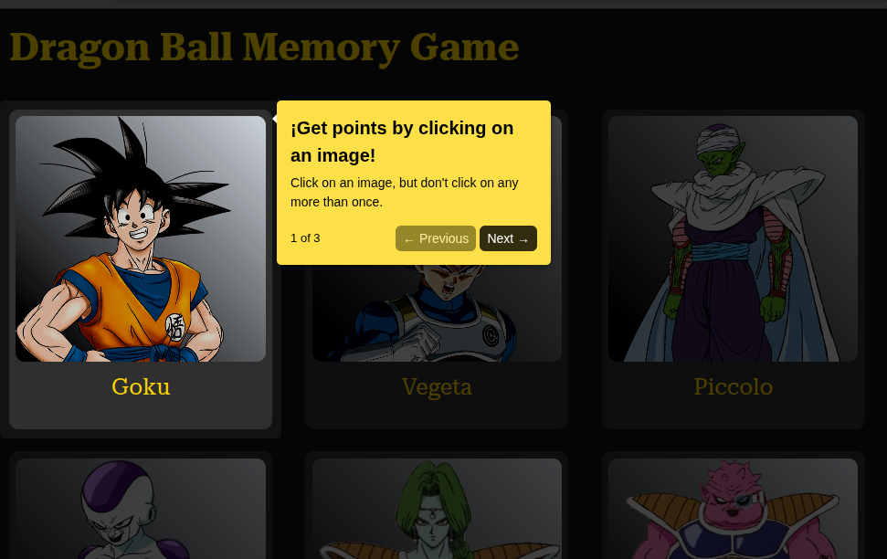

# 🃏 Memory Card Game

An interactive memory game built with React.
The goal is to click on each card only once without repeating any.
Each correct click increases your score, but if you pick a card twice, your score resets!


## 🚀 Tech Stack

- ⚛️ React
- 🎨 CSS
- 🛠️ Vite


## 🎮 Features

- Randomized cards on each round
- Cards reshuffle after every click
- Scoring system:
  - Current Score → number of unique cards selected
  - Best Score → highest score reached during  the session
- Automatic reset if a card is clicked twice
- Responsive design for desktop and mobile


## 📸 Screenshot




## 🌐 Demo

https://vilcoder-memory-card.vercel.app/


## 📦 Run Locally

Clone the project

```bash
  git@github.com:VilCoder/memory-card.git
```

Go to the project directory

```bash
  cd memory-card
```

Install dependencies

```bash
  npm install
```

Start the server

```bash
  npm run dev
```

